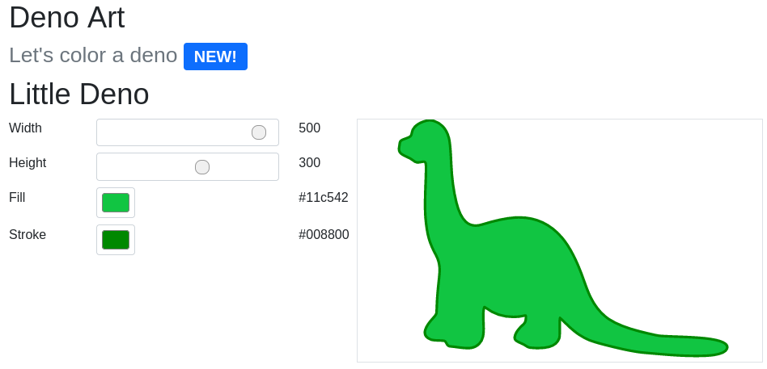

# What is it
This is an excercise I made for myself while learning Deno and Typescript and React. I wanted to make React work with Deno and Typescript (and nvim) so this is my first "web" React app written in Typescript and Deno.

This is browser-only fill/stroke/size configurer for SVG image (which I converted to React component).

